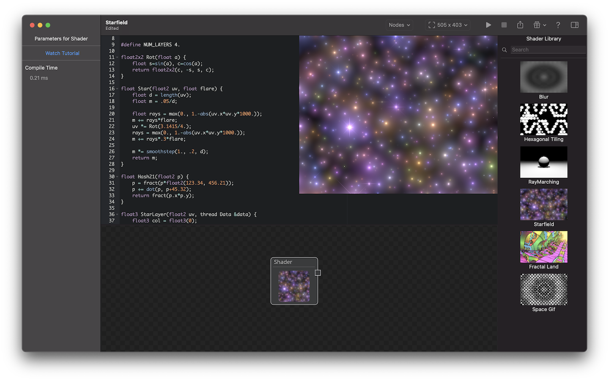

ShaderMania is an editor for procedural Metal fragment shaders featuring realtime preview and playback.

You can download it from the [AppStore here](https://apps.apple.com/us/app/shadermania/id1541065830).

macOS Big Sur or iOS 14.x is required.

Features:

* Syntax check and compilation of your shaders with realtime preview.
* Render to custom resolutions and export your shader output to PNG.
* Display of syntax errors and warnings.
* Add textures to your project by importing images.
* Shaders can be chained with each shader supporting up to 4 inputs (shaders or textures).
* Common shader code which is shared by all shaders.

A help file explains the parameters and syntax of the main entry point for each shader.

Thanks to [Kali](https://www.shadertoy.com/user/Kali) for allowing me to use his [Fractal Land](https://www.shadertoy.com/view/XsBXWt) shader for the app and it's icon.