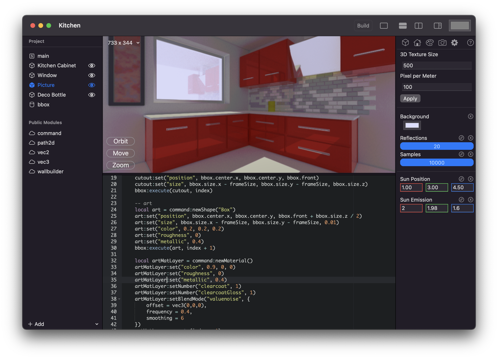

*Signed* is a Lua based 3D modeling language, it provides a unique way to create high quality 3D content for your game or visualization.

Artist driven workflows of the major 3D editing packages are great, for artists. Developers still have a hard time creating high quality content for their games and *Signed* hopes to fill this gap.

*Signed* itself is a development language, but it will over time provide tools to dynamically visualize for example paths and areas while typing.

*Signed* will be available for macOS and iPad OS and is heavily optimized for Metal.